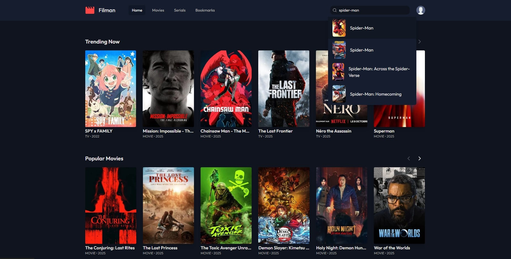

# 🎬 Filman [](https://github.com/pdemianowicz/react-movie-app-filman/actions/workflows/ci.yml)

**Filman** is a modern, Netflix-inspired web application for discovering movies and TV shows. This project was built with a modern frontend stack and fetches all of its data from the public API of [The Movie Database (TMDB)](https://www.themoviedb.org/).



---

## 🚀 Core Features

- **Content Discovery**: A homepage featuring dynamically loaded carousels for Trending, Popular Movies, and Popular TV Shows.
- **Detailed Views**: Dedicated pages for movies, TV shows, and people, presenting detailed information, cast, image galleries, and trailers.
- **Advanced Search**: An intelligent search bar with debouncing to prevent excessive API requests while typing.
- **Recommendations**: "You might also like" sections suggesting similar titles.
- **Fully Responsive Design**: The interface seamlessly adapts to various screen sizes, from mobile phones to large desktops.
- **Dynamic Routing**: Smooth, single-page application (SPA) navigation without page reloads, powered by react-router-dom.

---

## 💻 Tech Stack

This project is built with a modern and efficient technology stack:

- **[Vite](https://vitejs.dev/)** - A lightning-fast build tool and development server.
- **[React](https://reactjs.org/)** - A JavaScript library for building user interfaces.
- **[TypeScript](https://www.typescriptlang.org/)** - Strong typing for code safety and scalability.
- **[Tailwind CSS](https://tailwindcss.com/)** - A utility-first CSS framework for rapid UI development.
- **[React Router DOM](https://reactrouter.com/)** - A library for client-side routing.

---

## 🛠️ Local Installation & Setup

To run this project on your local machine, follow these steps:

**1. Clone the repository:**

**2. Install dependencies:**
This project uses `pnpm` as the package manager.

**3. Set up environment variables:**
The application requires an API key from TMDB.

- Create a file named `.env` in the root of the project.
- Sign up on [The Movie Database](https://www.themoviedb.org/signup) to get your free API key.
- In the `.env` file, add the following line, pasting your API key:

```
VITE_TMDB_API_KEY=YOUR_API_KEY_HERE
```

**4. Start the development server:**

```bash
pnpm dev
```

The application should now be available at `http://localhost:5173` (or another port if specified in the console).

---

## 📂 Project Structure (Simplified)

```/
├── public/
├── src/
│   ├── components/    # Reusable components (e.g., Header, MediaCard)
│   ├── hooks/         # Custom hooks (e.g., useMovieDetails, useSearch)
│   ├── pages/         # Main views/pages (e.g., Home, MovieDetails)
│   ├── types/         # TypeScript type definitions
│   ├── utils/         # Helper functions (e.g., API fetch, date formatting)
│   ├── App.tsx        # Main component with routing
│   └── main.tsx       # Application entry point
├── .env               # Environment variables (API key)
└── package.json
```

---

## 🙏 Acknowledgements

This project would not be possible without the fantastic and free API provided by **[The Movie Database (TMDB)](https://www.themoviedb.org/)**.
